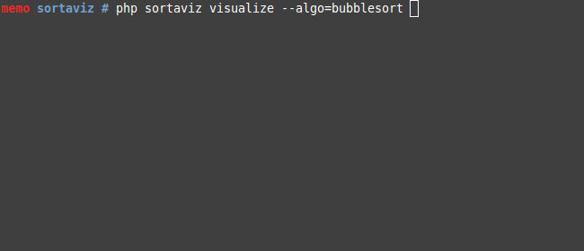
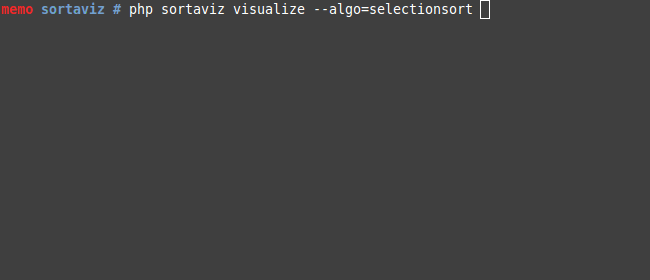

# Sortaviz (Sorting Algorithm Vizualization)
A command line tool to visualize sorting algorithms.

## Installation

    git clone https://github.com/malios/sortaviz
    cd sortaviz
    composer install

## Usage

    php sortaviz visualize --algorithm=<name> --speed=<speed>

Currently available algorithms are `bubblesort`, `selectionsort`, `insertionsort`.

The speed (optional) must be a positive number, e.g. `--speed=2`, `--speed=0.2`, `--speed=12`. Default is 1.

## Testing

    composer test

## Contributing

All contributors are welcome. You can open a new issue or submit a pull request.

## License

This project is licensed under the MIT License - see the [LICENSE.md](LICENSE.md) file for details.